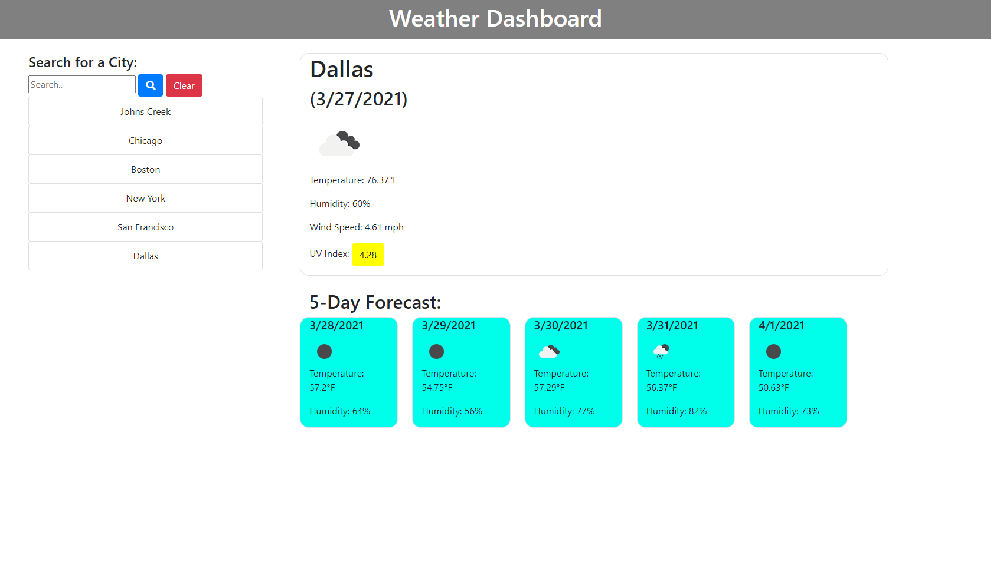

# 06 Server-Side APIs: Weather Dashboard

## Description

[My Weather Dashboard Website!](https://kroh1031.github.io/week-06-weather-dashboard/)  
For this week's homework, I created a weather dashboard by retrieving data from another application's API and using it in the context of my own.  
The purpose of building this project was to allow users to see the weather outlook for multiple cities so that they can plan a trip accordingly.  
I used local storage so that the searched cities persist even when the page is refreshed.

## Installation

The steps that I took in order to deploy my website:

1. First, I used the git add, git commit, and git push commands to save and push my code to my GitHub repository.
2. Then, I navigated into my GitHub repository's Settings tab.
3. From the settings page, I scrolled down to the GitHub Pages section and selected the master branch as my source.
4. After doing so, I was finally able to get the URL for my now deployed website.

## Usage

To use my website, search for a city name and the current and future weather conditions for that city will be displayed on the page.  
Then, click on any of the previously searched cities in the search history to again be presented with the according current and future weather conditions for the city.  
Finally, click on the clear button to get rid of the search history.

Screenshot of Weather Dashboard:

## Credits

Credits to Kat Poulos and Jude Clark for helping me out with solving out the code and making it more efficient.  
YouTube tutorial I've watched to gain a better understanding of the assignment: [https://www.youtube.com/watch?v=WZNG8UomjSI](https://www.youtube.com/watch?v=WZNG8UomjSI)

## License

MIT License
Copyright (c) [2021] [Karen Roh]
Permission is hereby granted, free of charge, to any person obtaining a copy
of this software and associated documentation files (the "Software"), to deal
in the Software without restriction, including without limitation the rights
to use, copy, modify, merge, publish, distribute, sublicense, and/or sell
copies of the Software, and to permit persons to whom the Software is
furnished to do so, subject to the following conditions:
The above copyright notice and this permission notice shall be included in all
copies or substantial portions of the Software.
THE SOFTWARE IS PROVIDED "AS IS", WITHOUT WARRANTY OF ANY KIND, EXPRESS OR
IMPLIED, INCLUDING BUT NOT LIMITED TO THE WARRANTIES OF MERCHANTABILITY,
FITNESS FOR A PARTICULAR PURPOSE AND NONINFRINGEMENT. IN NO EVENT SHALL THE
AUTHORS OR COPYRIGHT HOLDERS BE LIABLE FOR ANY CLAIM, DAMAGES OR OTHER
LIABILITY, WHETHER IN AN ACTION OF CONTRACT, TORT OR OTHERWISE, ARISING FROM,
OUT OF OR IN CONNECTION WITH THE SOFTWARE OR THE USE OR OTHER DEALINGS IN THE
SOFTWARE.

## Badges

